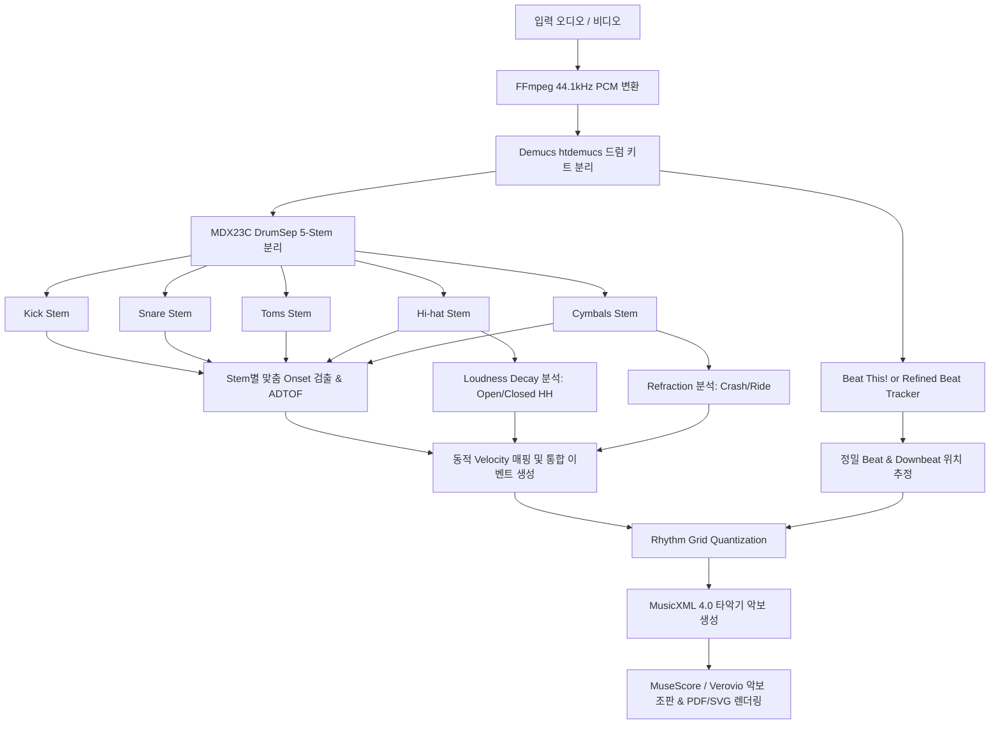

# 드럼 채보 개선 및 모델 교체 인수인계 (Handoff Report)

## 1. 개요 및 목적
- **목적**: 기존 파이프라인(`Demucs htdemucs` → `ADTOF Frame_RNN` → `Librosa Beat Tracking` → `MusicXML / MuseScore / Verovio`)의 드럼 악기별(Kick, Snare, Tom, Hi-hat, Cymbal) 분리 및 채보 정확도 저하 문제를 해결.
- **요구사항**: 최신/우수한 오픈소스 모델 교체 및 개선 방안을 고안하고, 새 브랜치에서 구현 작업을 원활히 이어갈 수 있도록 상세 설계 및 현황 정리.

---

## 2. 기존 구현 문제점 분석 (Root Cause Analysis)

1. **단일 5클래스 모델의 스펙트럼 중첩 한계**:
   - 기존 `ADTOF` 모델은 단일 드럼 오디오 트랙 전체를 보고 한 번에 5종(Kick 35, Snare 38, Tom 47, Hi-hat 42, Cymbal 49)을 동시 추론.
   - 킥/스네어/탐/심벌의 주파수 대역이 겹칠 때 상호 간섭으로 인해 탐이 스네어로 오분류되거나 심벌/하이햇 오검출이 빈번함.
   - 고정 임계값(Threshold)에 극도로 민감함.

2. **BPM 추정 및 비트 위상(Beat Phase)의 체계적 오차 (Systematic Delay)**:
   - 실제 기존 실험 데이터(`b89900de...`, `85aa4412...`) 분석 결과:
     - `Librosa` 비트 추적 결과는 실제 어택(Attack/Onset) 피크보다 **약 28~38ms 뒤쪽**에 비트가 찍히는 systematic delay 존재.
     - 이로 인해 16분 음표 격자 스냅 시 앞/뒤 박자로 밀려 악보가 부정확해짐.
     - Downbeat(첫 박 마디 위치) 추론이 없어 마디 시작이 어긋남.

3. **심벌 세부 분류(Crash vs Ride) 및 하이햇(Open vs Closed) 미지원**:
   - 악보 품질이 조악해지는 큰 원인 중 하나로, 하이햇 오픈/클로즈 구분 불가, 크래시/라이드 미구분 문제가 있음.

---

## 3. 최신 오픈소스 조사 및 대안 기술 스택

### A. 모델 벤치마크 및 검토 결과
1. **DrumSep (MDX23C 5-stems by jarredou)**
   - **구조**: 드럼 트랙을 세부 5스템(`kick`, `snare`, `toms`, `hh`, `cymbals`)으로 2차 분리(Demixing).
   - **성능 (SDR)**: Kick 16.66 dB, Snare 11.53 dB, Toms 12.33 dB, HH 4.04 dB, Cymbals 6.36 dB.
   - **장점**: 각 악기별 스템이 완전히 격리된 오디오로 분리되므로, 킥 stem에서는 킥만, 스네어 stem에서는 스네어만 검출할 수 있어 악기간 오분류/간섭이 획기적으로 제거됨.
   - **가중치 파일**: Hugging Face `xavriley/source_separation_mirror`에 `drumsep_5stems_mdx23c_jarredou.ckpt` (약 437MB) 및 `config_mdx23c_drumsep2025.yaml` 존재 확인 완료.

2. **ADTOF Plus 파이프라인 (2025 최신 연구 / xavriley)**
   - **접근 방식**:
     1. Mix → Drum kit (`Demucs` 또는 `MDX23C kit_from_mix`)
     2. Drum kit → 5 stems (`DrumSep MDX23C`: kick, snare, toms, hh, cymbals)
     3. 각 분리된 스템별로 ADTOF / Onset 검출 적용 (예: 킥 스템에서 킥 검출, 스네어 스템에서 스네어 검출)
     4. **Hi-hat 오픈/클로즈 판별**: 지속 시간(sustain/decay loudness) 분석을 통해 42(Closed)와 46(Open) 분류.
     5. **Cymbal 크래시/라이드 판별**: decay 특성 및 refraction period 분석으로 49(Crash)와 51(Ride) 분류.
     6. **RMS 기반 Velocity 계산**: 각 타격의 강약(Velocity 1~127)을 스템 에너지로 정밀 매핑.
   - **결과**: MDB 및 ENST 데이터셋에서 F1 점수가 크게 향상됨(MDB 0.84+, ENST 0.76+).

3. **Beat This! (CPJKU - 2025/2026 SOTA Beat & Downbeat Tracker)**
   - Roformer 기반 구조 (`beat-this` PyPI 패키지 1.1.0 지원).
   - 단순 템포 추정을 넘어 정밀 비트 위치 및 **Downbeat(1번 마디 첫 박)**을 완벽히 인식하여 기존 Librosa의 30ms 딜레이 및 마디 틀어짐 문제 해결 가능.

---

## 4. 제안 아키텍처 및 파이프라인 설계



---

## 5. 새 브랜치 작업 계획 및 To-Do List

새 브랜치: `feature/drumsep-enhanced-transcription`

### Step 1: 브랜치 생성 및 환경 구성
```bash
git checkout -b feature/drumsep-enhanced-transcription
```
- `pyproject.toml` 및 `uv.lock` 업데이트:
  - Hugging Face 모델 다운로드용 `huggingface_hub` 추가
  - `rotary-embedding-torch`, `einops` 등 필요한 경량 의존성 점검

### Step 2: DrumSep (MDX23C 5-Stem) 모듈 구현
- `src/transcription/drumsep.py` 생성:
  - `TFC_TDF_net` 모델 정의 (약 200줄 순수 PyTorch 코드로 기존 의존성 충돌 없이 임베딩 가능)
  - Hugging Face `xavriley/source_separation_mirror`에서 `drumsep_5stems_mdx23c_jarredou.ckpt` 캐싱 로직
  - 드럼 오디오(`drums.wav`)를 입력받아 5개 채널 분리

### Step 3: Stem-Specific 검출 및 악기 확장 (7-class + Velocity)
- `src/transcription/detector.py`:
  - 킥 스템 → Kick(35) 타격 검출
  - 스네어 스템 → Snare(38) 타격 검출
  - 탐 스템 → Toms(47) 타격 검출
  - 하이햇 스템 → Closed HH(42) 및 Open HH(46) 판별
  - 심벌 스템 → Crash(49) 및 Ride(51) 판별
  - RMS loudness 기반 타격 세기(Velocity) 산출

### Step 4: 템포 및 비트 위상 보정 (Beat Tracker 고도화)
- `src/transcription/pipeline.py`의 `estimate_tempo` 개선:
  - Librosa 사용 시 발견된 약 30ms의 체계적 어택 딜레이 오프셋 보정 적용
  - 또는 `Beat This!` 모델 연동을 통한 다운비트(마디 시작점) 자동 감지

### Step 5: 악보 렌더링 및 UI 반영
- `src/transcription/score.py`:
  - KIT 딕셔너리에 Open Hi-hat(46, 'x' head + open circle), Ride Cymbal(51) 표기 지원 추가
- 단위 테스트(`tests/`) 및 기존 회귀 테스트 검증

---

## 6. 연구용 캐시 및 로컬 참고 리소스
- 임시 분석용 클론 저장소: `/tmp/beatit-research/`
  - `adtof_plus_drum_transcription/` (논문 및 핵심 로직)
  - `mdx23c-drum-separation/` (MDX23C 모델 아키텍처)
  - `beat_this/` (최신 비트 추적기)
  - `MDBDrums/` (MDB 검증 데이터셋, 3.2GB)
